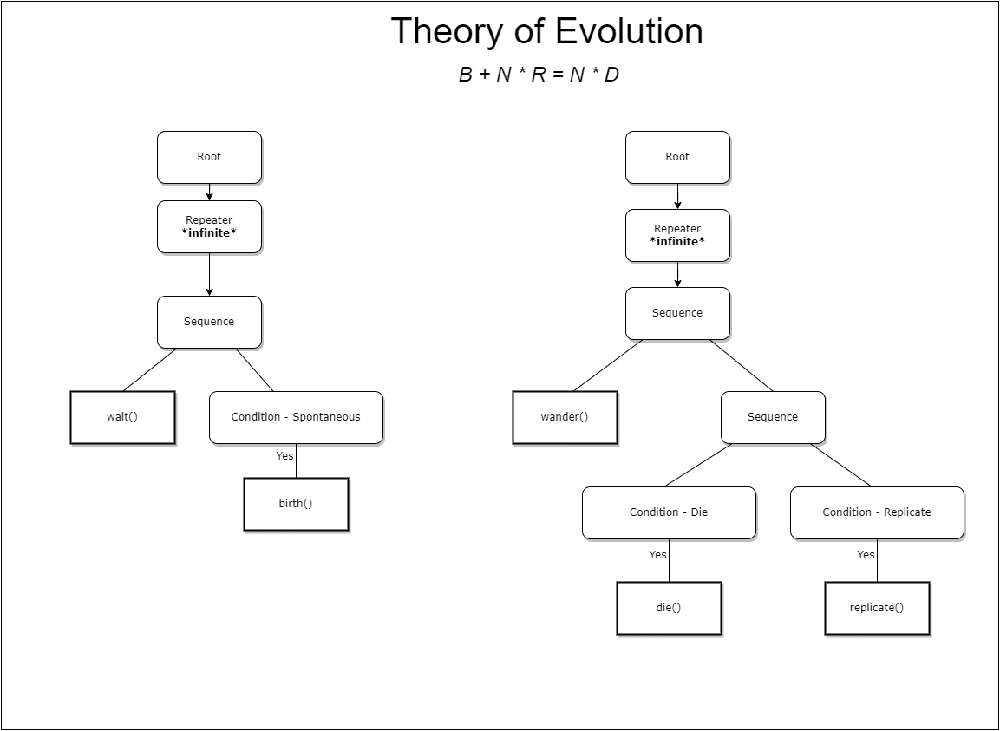

# Coffee Game Engine 
## _Hobby Project :  C++ 2D game engine on SDL_
### Update 0.1 : Behaviour Tree
- Github backup @ :https://github.com/sanchitgulati/coffee-game-engine-from-bitbucket/
- Version 0.0 repo : https://bitbucket.org/sanchitgulati/coffee-game-engine/src/master/

Testing the behaviour tree data structure using **"Theory of evolution 101 by primer"**


YT Video : [Evolution - Primer](https://www.youtube.com/playlist?list=PLKortajF2dPBWMIS6KF4RLtQiG6KQrTdB) 

## Features

- 2D Camera based custom pipe GL renderer
- Scene Manager
- Event System
- Inheritable and extendable GameObject
- Tween Sequence System
- cmake build system

## Third Party Libs
- GLEW
- GLM
- SDL2
- SDL2-TTF
- SDL2-mixer
- SDL2-image

## Installation

Install the dependencies 
```sh
cd libs/glew
cmake .
cmake --build . 
```

For Game Project

```sh
cmake .
cmake --build .
cd .\build\Debug\
./SDL_project
```


## Few How-To’s
---

#### Adding GameObjects to Scene
```c++
auto background = Sprite::createWithFile(GameValues::BG);
background->setPosition(WIN_WIDTH *0.5f, WIN_HEIGHT * 0.5f);
addChild(background);
```

#### Chainable sequence system

```c++
makeSequence()
->add(SCALE_TO(shared_from_this(), 1.f, 0.9f, 0.1f))
->add(FUNC_CALL([this]() {
AudioManager.playAudio(GameValues::sfxCLICK);
_pressedState->setVisible(true); }))
->add(SCALE_TO(shared_from_this(), 0.9f, 1.1f, 0.1f))
->add(SCALE_TO(shared_from_this(), 1.1f, 1.f, 0.1f))
->add(DELAY(.5f))
->add(FUNC_CALL([this]() {
std::invoke(_callback);
}));
```

#### Behaviour Tree

```c++
_root = std::make_shared<BehaviourTree::Root>();
auto wait = std::make_shared<BehaviourTree::Wait>(.1f);
auto conditionBirth = std::make_shared<BehaviourTree::Condition>(std::bind(&World::conditionBirth, this));
auto birthAction = std::make_shared<BehaviourTree::Action>(std::bind(&World::birth, this));
conditionBirth->onTrue(birthAction);
auto sequence = std::make_shared<BehaviourTree::Sequence>();
sequence->addChild(wait);
sequence->addChild(conditionBirth);
auto repeater = std::make_shared<BehaviourTree::Repeater>(-1);
repeater->setChild(sequence);
_root->addChild(repeater);
```



#### Screengrab


#### Resources

Music : [Hope - ROFEU](https://www.youtube.com/watch?v=W-w1hVLvIJw) 
Art : [Game Art Guppy](https://www.gameartguppy.com/) 

